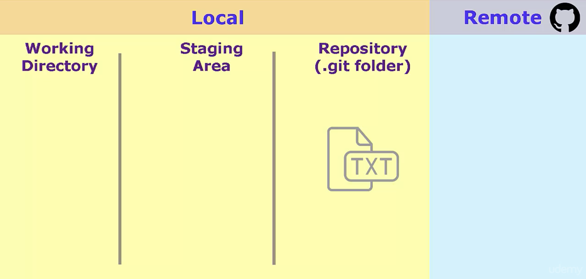
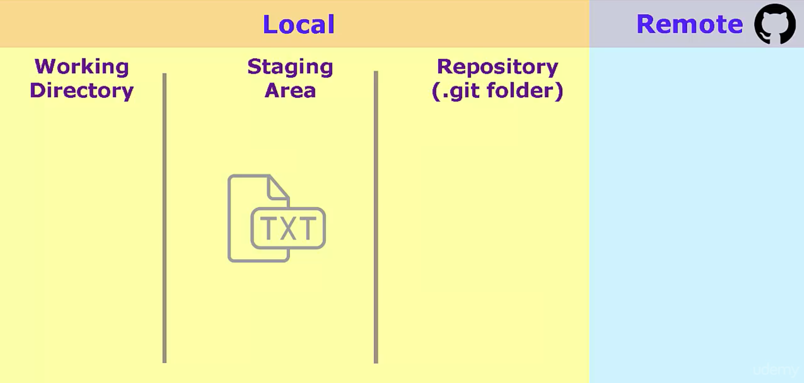
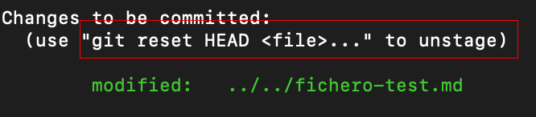
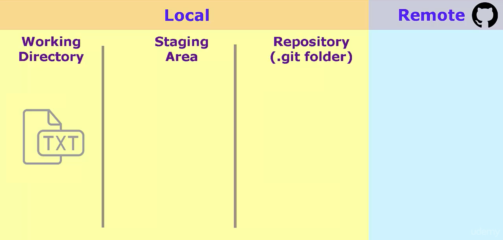
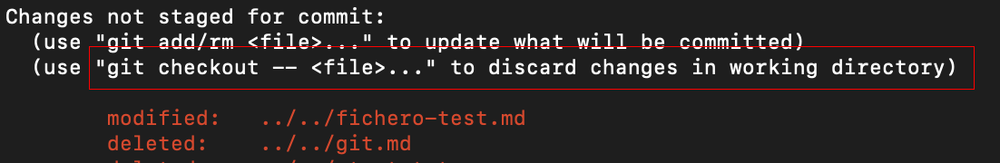

# Descartar Cambios

Al trabajar sobre **un mismo fichero esté puede tener diferentes versiones del mismo**:

1. Puede haber una versión en el repositorio local
2. Este también puede estar en Staging Area con una versión diferente


En esta página vamos a explicar cómo tener este escenario:

1. **Un fichero está commiteado en el Local Repository**

    

2. **Hacemos nuevas modificaciones en ese mismo fichero**

3. **Añadimos estas nuevas modificaciones al Staging Area**

    

4. **Queremos eliminar las morificaciones añadidas al Stagging Area**

    
    ```
    git reset HEAD nombre-del-fichero.md
    ```
    
    Entonces el fichero vuelve a estar dentro del Working Directory

    

5. Recuperar el fichero commiteado al Local Ropository

    
    ```
    git checkout -- nombre-del-fichero.md
    ```
