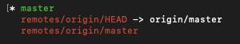

# Trabajar con Ramas

1. [Listar ramas](#listar-ramas)
2. [Crear una nueva rama](#crear-nueva-rama)
3. [Renombrar ramas](#renombrar-ramas)
4. [Borrar ramas](#borrar-ramas)
5. [Crear y moverse a una rama en un solo paso](#crear-y-moverse-a-una-rama-en-un-solo-paso)

## Listar ramas

Para conocer todas las ramas que exiten en el local y en el repositorio remoto.

```
git branch -a
```



La rama en local en la que te encuentras se marca con asterisco.

### Para listar solo las ramas locales

```
git branch
```

## Crear nueva rama

El comando para crear una nueva rama es el siguiente:

```
git branch nombreNuevaRama
```

Con esto aún no estamos en la rama que hemos creado. Para movernos a la nueva rama tenemos que utilizar el comando **checkout**

```
git checkout nombreNuevaRama
```

## Renombrar ramas

Para cambiar el nobre de una rama a otra
```
git branch -m nombreNuevaRama nuevoNombreRama
```

## Borrar ramas

```
git branch -d nombreRamaBorrar
```

Master no se puede borrar y tienes que estar en una rama diferente a la que quieres borrar para poder borrarla.

## Crear y moverse a una rama en un solo paso

Para realizar los pasos de crear una rama y movernos a la nueva rama que acabamos de crear podemos realizar el atajo de:

```
git checkout -b nombreRama
```
